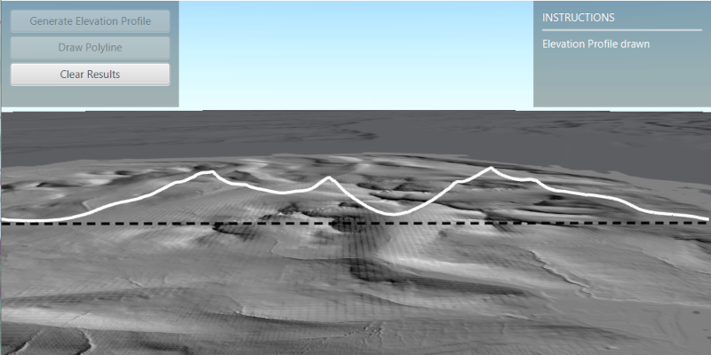

# Local Server generate elevation profile

Create an elevation profile from local raster data and a polyline, using a local geoprocessing package `.gpkx` created using the interpolate shape geoprocessing tool in ArcGIS Pro.

## Use case

Local server applications are helpful for executing offline geoprocessing tasks in your ArcGIS Runtime apps via an offline (local) server. This sample uses a geoprocessing package created with the Interpolate Shape tool, which creates 3D feature by interpolating z-values from a surface.

## How to use the sample

Contour Line Controls (Top Left):

* Interval - Specifies the spacing between contour lines.
* Generate Contours - Adds contour lines to map using interval.
* Clear Results - Removes contour lines from map.

## How it works

1. Create and run a local server with `LocalServer.INSTANCE`.
2. Start the server asynchronously with `Server.startAsync()`.
3. Wait for server to be in the  `LocalServerStatus.STARTED` state.
    * Callbacks attached to `Server.addStatusChangedListener()` will invoke whenever the status of the local server has changed.
4. Start a `LocalGeoprocessingService` and run a `GeoprocessingTask`.
    1. Instantiate `LocalGeoprocessingService(Url, ServiceType)` to create a local geoprocessing service.
    2. Invoke `LocalGeoprocessingService.start()` to start the service asynchronously.
    3. Instantiate `GeoprocessingTask(LocalGeoprocessingService.url() + "/Contour")` to create a geoprocessing task that uses the contour lines tool.
5. Create an instance of `GeoprocessingParameters` and add a `GeoprocessingDouble` as a parameter using `setInterval`.
    1. Instantiate `GeoprocessingParameters(ExecutionType)` creates geoprocessing parameters.
    2. Create a parameter using `GeoprocessingParameters.getInputs().put("Interval", new GeoprocessingDouble(double))` with name "Interval" and with the interval set as its value.
6. Create and start a `GeoprocessingJob` using the previous parameters.
    1. Create a geoprocessing job with `GeoprocessingTask.createJob(GeoprocessingParameters)`.
    2. Start the job with `GeoprocessingJob.start()`.
7. Add contour lines as an `ArcGISMapImageLayer` to the map.
    1. Get url from local geoprocessing service using `LocalGeoprocessingService.getUrl()`.
    2. Get server job id of geoprocessing job using `GeoprocessingJob.getServerJobId()`.
    3. Replace `GPServer` from url with `MapServer/jobs/jobId`, to get generate contour lines data.
    4. Create a map image layer from that new url and add that layer to the map.

## Relevant API

* GeoprocessingDouble
* GeoprocessingJob
* GeoprocessingParameter
* GeoprocessingParameters
* GeoprocessingTask
* LocalGeoprocessingService
* LocalGeoprocessingService.ServiceType
* LocalServer
* LocalServerStatus

## Additional information

Local Server can be downloaded for Windows and Linux platforms from your [ArcGIS Developers dashboard](https://developers.arcgis.com/java/local-server/install-local-server/). Local Server is not supported on macOS.

Specific versions of ArcGIS Runtime Local Server are compatible with the version of ArcGIS Pro you use to create geoprocessing and map packages. For example, the ArcGIS Runtime API for Java v100.11.0 is configured for Local Server v100.10.0 which provides compatibility for packages created with ArcGIS Pro 2.7.x. For more information see the [ArcGIS Developers guide](https://developers.arcgis.com/java/reference/system-requirements/#local-server-version-compatibility-with-arcgis-desktop-and-arcgis-pro).

To configure the ArcGIS Runtime API for Java v100.11.0 to work with Local Server 100.9.0:

* Development machine:
    * Locate the Local Server installation directory and rename the folder from `LocalServer100.9` to `LocalServer100.10`.
    * Update the environment variable from `RUNTIME_LOCAL_SERVER_100_9` to `RUNTIME_LOCAL_SERVER_100_10`.
* Deployment machine(s): Rename the deployment folder included with your application (or referenced by the LocalServerEnvironment.InstallPath property) from `LocalServer100.9` to `LocalServer100.10`.

## Tags

geoprocessing, local, offline, parameters, processing, service
