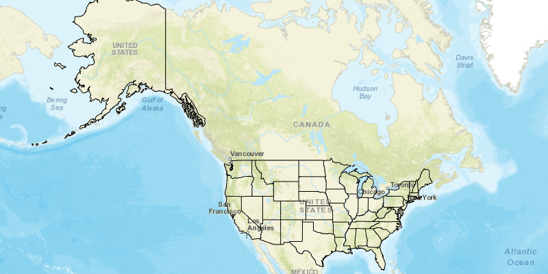

<h1>Local Server Map Image Layer</h1>

Create a local map imagery service and show its tiles in a map.

<b>Note:</b> Local Server is not supported on MacOS

<h2>How to use the sample</h2>

A Local Server and Local Map Service will automatically be started and once running a Map Image Layer will be created and added to the map. 

<h2>How it works</h2>

To create a <code>ArcGISMapImageLayer</code> from a <code>LocalMapService</code>:

<ol>
<li>Create and run a local server.
<ul><li><code>LocalServer.INSTANCE</code> creates a local server</li>
<li><code>Server.startAsync()</code> starts the server asynchronously</li></ul></li>
<li>Wait for server to be in the  <code>LocalServerStatus.STARTED</code> state.
<ul><li><code>Server.addStatusChangedListener()</code> fires whenever the status of the local server has changed.</li></ul></li>
<li>Create and run a local map service.
<ul><li><code>new LocalMapService(Url)</code>, creates a local map service with the given url path to mpk file</li>
<li><code>LocalMapService.startAsync()</code>, starts the service asynchronously</li>
<li>service will be added to the local server automatically</li></ul></li>
<li>Wait for map service to be in the  <code>LocalServerStatus.STARTED</code> state.
<ul><li><code>LocalMapService.addStatusChangedListener()</code> fires whenever the status of the local service has changed.</li></ul></li>
<li>Create a map image layer from local map service.
<ul><li>create a <code>new ArcGISMapImageLayer(Url)</code> from local map service url, <code>LocalMapService.getUrl()</code></li>
<li>load the layer asynchronously, <code>ArcGISMapImageLayer.loadAsync()</code></li></ul></li>
<li>Add map image layer to map, <code>Map.getOperationalLayers().add(ArcGISMapImageLayer)</code>.</li>
</ol>

<h2>Relevant API</h2>
<ul>
<li>ArcGISMapImageLayer</li>
<li>LocalMapService</li>
<li>LocalServer</li>
<li>LocalServerStatus</li>
<li>StatusChangedEvent</li>
</ul>

