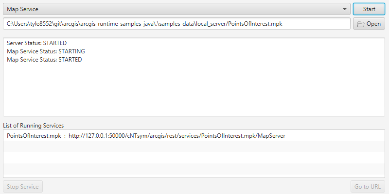

# Local server services

Demonstrates how to start and stop the Local Server and start and stop a local map, feature, and geoprocessing service running on the Local Server.

## Use case

For executing offline geoprocessing tasks in your ArcGIS Runtime apps via an offline (local) server.

## How to use the sample

Click `Start Local Server` to start the Local Server. Click `Stop Local Server` to stop the Local Server.

The `Map Service` combo box lets you to pick a local service that is available.

After browsing for the desired file, click `Start Service` to start the selected service.

When the running service's url appears, select it and click `Open Url`. To stop this running service, click `Stop Service`.

## How it works

To start a `LocalServer` and attach a `LocalService`:

1. Create and run a local server with `LocalServer.instance`.
2. Start the server asynchronously with `Server.startAsync()`.
3. Wait for server to be in the  `LocalServerStatus.STARTED` state.
   * Callbacks attached to `Server.addStatusChangedListener()` will invoke whenever the status of the local server has changed.
4. Create and run a local service. Here is an example of running a `LocalMapService`:
    1. Instantiate `LocalMapService(Url)` to create a local map service with the given URL path to map package (`mpk` or `mpkx` file).
    2. Start the job with `LocalMapServic.estartAsync()`.
       * The service is added to the `LocalServer` automatically.

To stop a `LocalServer` and any attached `LocalServices`:

1. If required, you can retrieve a list of all running services with `LocalServer.INSTANCE.getServices()`.
2. Stop the services asynchronously using `LocalService.stopAsync()`.
3. Use `LocalServer.INSTANCE.stopAsync()` to stop the server asynchronously. You can use `.addDoneListener()` on this process to perform additional actions after the server is successfully stopped, such as removing temporary files

## Relevant API

* LocalFeatureService
* LocalGeoprocessingService
* LocalMapService
* LocalServer
* LocalServerStatus
* LocalService

## Additional information

Local Server can be downloaded for Windows and Linux platforms. Local Server is not supported on macOS.

## Tags

feature, geoprocessing, local services, map, server, service
