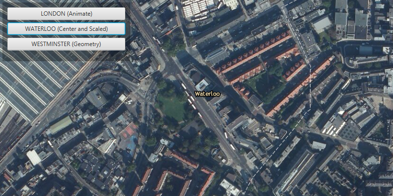

#Change Viewpoint#
This sample demonstrates different ways in which you can change the `Viewpoint` or visible area of an `ArcGISMap`.

##How to use the sample##
The `MapView` provides different methods you can use to set the viewpoint. The app uses the `setViewpointWithDurationAsync` method for animation to zoom to London, `setViewpointCenterWithScaleAsync` method to zoom to Waterloo at a certain scale and `setViewpointGeometryAsync` method to zoom to Westminstes area. Apart from these, there are some other methods (mentioned below) you can use.

- setViewpoint
- setViewpointAsync
- setViewpointCenterAsync
- setViewpointGeometryWithPaddingAsync
- setViewpointRotationAsync
- setViewpointScaleAsync

##How it works##
To change the viewpoint:

- Create an ArcGISMap 
- Set the map to the view via `MapView` via `MapView#setMap()`. 
- Change the Viewpoint using the `MapView#setViewPoint` methods mentioned above.

##Features##
- ArcGISMap
- Basemap
- Point
- Viewpoint
- SpatialReference
