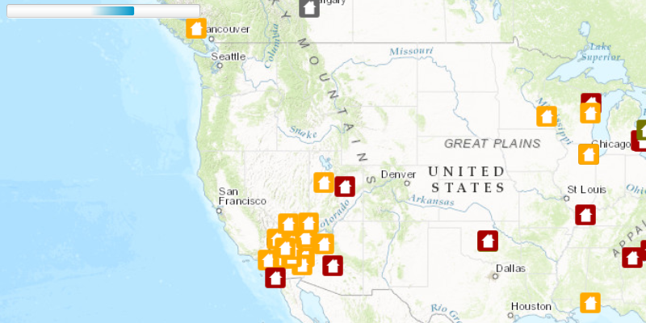

#Display Drawing Status#
This sample display the current drawing status of the `MapView` in the progress bar.

##How to use the sample##
The `MapView#addDrawStatusChangedListener` block is called each time the `DrawStatus` changes on the map. In this sample the block shows a progress bar indicating when the DrawStatus is `IN_PROGRESS` or `COMPLETED`.

##How it works##
To use the MapView's DrawStatus:

- Create an ArcGISMap 
- Set the map to the view via `MapView` via `MapView#setMap()`. 
- Add the `MapView#addDrawStatusChangedListener` block and listen when the DrawStatus changes via `DrawStatusChangedEvent`.

##Features##
- ArcGISMap
- MapView
- DrawStatus 
- DrawStatusChangedEvent