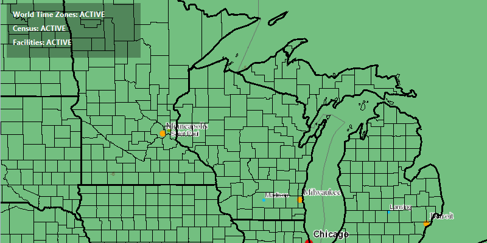

#Display Layer View State Status#
Demonstrates how to get view status for layers in a ArcGISMap. 

##How to use the sample##
The view status of a layer changes while the layer is loading, like the start of the application. If you pan or zoom the map, the view status of some layers should also change. 
The LayerViewStatus could be:
- ACTIVE
- ERROR
- LOADING
- NOT_VISIBLE
- OUT_OF_SCALE
- UNKNOWN

##How it works##
To use the `MapView`'s `DrawStatus`:

1. Create an `ArcGISMap`. 
2. Set the map to the `MapView`, `MapView.setMap()`. 
3. Add the `MapView.addLayerViewStateChangedListener()` property and listen when the `Layer.getLayerViewStatus()` changes.

##Features
- ArcGISMap
- ArcGISMapImageLayer
- Layer
- LayerViewStatus 
- LayerViewStateChangedEvent
- MapView
- Viewpoint
