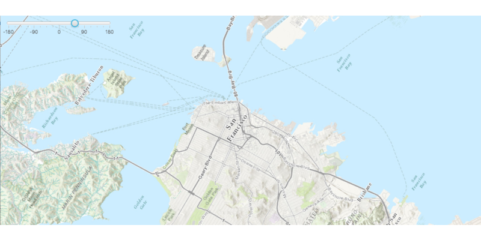

#Map Rotation#
Demonstrates how to rotate an ArcGISMap.

##How to use the sample##
The slider changes the rotation of the ArcGISMap.

##How it works##
To rotate an `ArcGISMap`:

1. Create an ArcGISMap. 
2. Add the map to the `MapView`, `MapView.setMap()`. 
3. Use `MapView.setViewpointRotationAsync` to indicate the rotation angle.

##Features##
- ArcGISMap
- Envelope
- MapView
- Point
