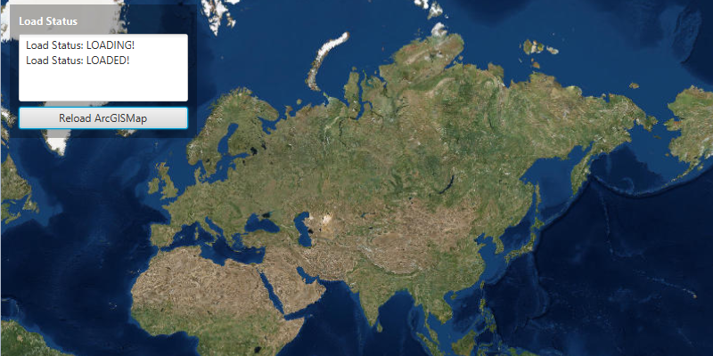

# Access Load Status

Determine when a map has finished loading.

## How to use the sample

The sample provides an information area which displays what the ArcGISMap's load status is. Click on the button to reload the ArcGISMap.

## How it works

To access the `ArcGISMap`'s `LoadStatus`:

1. Create an ArcGIS map.
2. Use `ArcGISMap.addLoadStatusChangedListener()` and `ArcGISMap.getNewLoadStatus()` to display the load status of the map.
3. Set the ArcGIS map to the `MapView` to began loading.

## Relevant API

* ArcGISMap
* Basemap
* MapView
* LoadStatus
