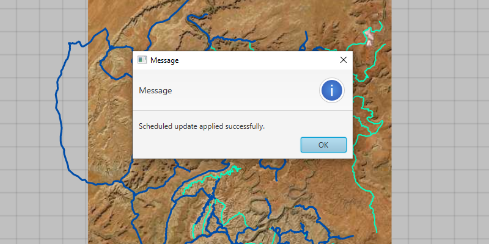

# Apply scheduled updates to preplanned map area

Apply scheduled updates to a downloaded preplanned map area.

## Use case

With scheduled updates, the author can update the features within the preplanned areas on the service once, and multiple end-users can request these updates to bring their local copies up to date with the most recent state. Importantly, any number of end-users can download the same set of cached updates which means that this workflow is extremely scalable for large operations where you need to minimize load on the server.

This workflow can be used by survey workers operating in remote areas where network connectivity is not available. The workers could download mobile map packages to their individual devices and perform their work normally. Once they regain internet connectivity, the mobile map packages can be updated to show any new features that have been added to the online service.

## How to use the sample

Start the app. It will display an offline map, check for available updates, and show an alert with update availability and size. Confirm to apply the updates to the local offline map and show the results.

## How it works

1. Create an `OfflineMapSyncTask` with an offline map.
2. Use `offlineMapSyncTask.checkForUpdatesAsync()` to get a `OfflineMapUpdatesInfo` object.
3. Check if the download availability on the info is `AVAILABLE`.
4. To download the updates, create default sync parameters from the task.
5. Set the `PreplannedScheduledUpdatesOption` and the rollback behavior on the parameters.
6. Use `offlineMapSyncTask.syncOfflineMap(parameters)` to create an `OfflineMapSyncJob`.
7. Start the job and get the `OfflineMapSyncResult`.
8. Check if the mobile map package needs to be reopened, and do so if necessary. Display the offline map to see the
 changes.

## Relevant API

* MobileMapPackage
* OfflineMapSyncJob
* OfflineMapSyncParameters
* OfflineMapSyncResult
* OfflineMapSyncTask
* OfflineMapUpdatesInfo

## About the data

The data in this sample shows the roads and trails in the Canyonlands National Park, Utah. Data by [U.S. National Parks Service](https://public-nps.opendata.arcgis.com/). No claim to original U.S. Government works.

## Additional information

**Note:** preplanned areas using the Scheduled Updates workflow are read-only. For preplanned areas that can be edited on the end-user device, see [Take a map offline - preplanned](https://developers.arcgis.com/java/latest/guide/take-map-offline-preplanned.htm).

## Tags

offline, preplanned, pre-planned, synchronize, update
