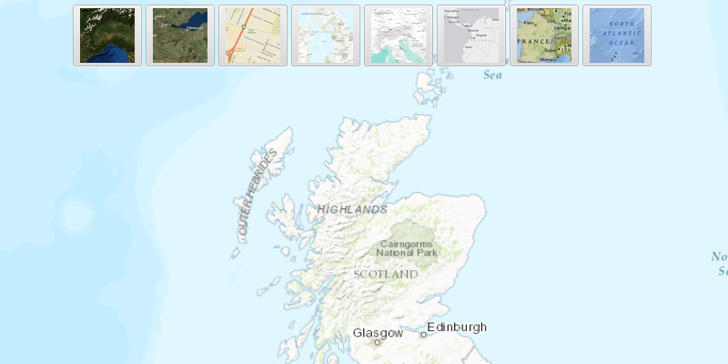

# Change basemap

Change a map's basemap. A basemap is beneath all layers on an `ArcGISMap` and is used to provide visual reference for the operational layers.

## Use case

Basemaps should selected contextually, for example, in maritime applications, it would be more appropriate to use a basemap of the world's oceans as opposed to a basemap of the world's streets.

## How to use the sample

Select a basemap from the list of available basemaps to set it to the map.

## How it works

1. Create an `ArcGISMap` object.
2. Set the map to the `MapView` object.
3. Choose a new basemap type with `Basemap.Type` and set it on the map.

## Relevant API
* ArcGISMap
* Basemap
* MapView

## Tags

basemap, map
