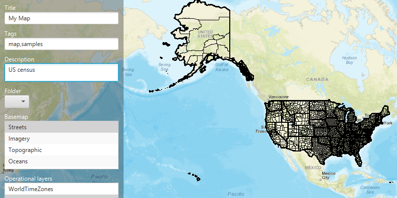

# Create and Save Map

Create and save a map to your own portal.

## Use case

Maps can be created programatically in code and then serialized and saved as an ArcGIS `web map`. A `web map` can be shared with others and opened in various applications and APIs throughout the platform, such as ArcGIS Pro, ArcGIS Online, the JavaScript API, Collector, and Explorer.

## How to use the sample

This sample requires you to setup your own app on arcgis.com. See the [wiki](https://github.com/Esri/arcgis-runtime-samples-java/wiki/OAuth) for details.

Fill in your portal and registered app credentials in the starting dialog to authenticate. Then, choose the basemap and layers for your new map. To save the map, choose a title, tags and description (optional), and a folder on your portal (you will need to create one in your portal's My Content). Click the Save button to save the map to the chosen folder.

## How it works

1. Create an `ArcGISMap` with a `Basemap` and operational layers.
2. Create an `OAuthConfiguration` with your portal and app credential.
3. Add the configuration to the `AuthenticationManager`.
4. Create a `Portal` and load it. Use a `DefaultAuthenticationChallengeHandler` to authenticate with your username and password.
5. Once authenticated, save the map by calling `map.saveMapAsAsync()`, passing in the title, tags, description, and portal folder.

## Relevant API

* AuthenticationManager
* DefaultAuthenticationChallengeHandler
* OAuthConfiguration
* Portal
* PortalFolder
* PortalItem
* PortalUserContent

## Tags

web map, portal