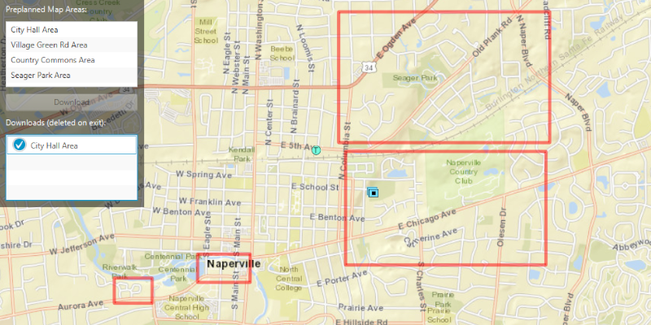

# Download a preplanned map area

Take a map offline using a preplanned map area.

## Use case

When using the preplanned workflow, the author of the web map can set up offline packages for a map area ahead of time, which can then be distributed to end-users to view on their devices. Because the resources for the area are packaged once and can be downloaded many times by different users, this approach is faster and more scalable for large organizations when compared to an on-demand workflow (where each end-user requests a specific area that is then generated and delivered by a service). For example, this workflow could be used by survey workers operating in remote areas where network connectivity is not available. The workers could download preplanned mobile areas to their individual devices ahead of time and perform their work normally while disconnected.

## How to use the sample

**NOTE:** Downloading Tiles for offline use requires authentication with the web map's server. To use this sample, you will require an [ArcGIS Online](www.arcgis.com) account.

Select a map area, then click "Download Preplanned Area" to take it offline. When viewing a downloaded map area, click 'Show Online Map' to return to the online map. Click "Delete All Downloaded Areas" to remove any downloaded map areas.

## How it works

1. Open the `Map` from a `PortalItem` and display it.
2. Create an `OfflineMapTask` from the portal item.
3. Get the `PreplannedMapArea`s from the task, and then load them.
4. To download a selected map area, create the default `DownloadPreplannedOfflineMapParameters` from the task using the selected preplanned map area.
5. Set the update mode of the preplanned map area with `PreplannedUpdateMode.NO_UPDATES`, so as not to apply any future updates (see additional information section for other options).
6. Use the parameters and a download path to create a `DownloadPreplannedOfflineMapJob` from the task.
7. Start the job. Once it has completed, get the  `DownloadPreplannedOfflineMapResult`.
8. Get the `Map` from the result and display it in the `MapView`.

## Relevant API

* DownloadPreplannedOfflineMapJob
* DownloadPreplannedOfflineMapParameters
* DownloadPreplannedOfflineMapResult
* OfflineMapTask
* PreplannedMapArea

## About the data

The [Naperville stormwater network map](https://arcgisruntime.maps.arcgis.com/home/item.html?id=acc027394bc84c2fb04d1ed317aac674) is based on ArcGIS Solutions for Stormwater and provides a realistic depiction of a theoretical stormwater network.

## Additional information

`PreplannedUpdateMode` can be used to set the way the preplanned map area receives updates in several ways:

* `NO_UPDATES` - No updates will be performed.
* `SYNC_WITH_FEATURE_SERVICES` - Changes, including local edits, will be synced directly with the underlying feature services.
* `DOWNLOAD_SCHEDULED_UPDATES` - Scheduled, read-only updates will be downloaded from the online map area and applied to the local mobile geodatabases.

See [Take a map offline - preplanned](https://developers.arcgis.com/java/latest/guide/take-map-offline-preplanned.htm) to learn about preplanned workflows, including how to define preplanned areas in ArcGIS Online. Alternatively, visit [Take a map offline - on demand](https://developers.arcgis.com/java/latest/guide/take-map-offline-ondemand.htm) or refer to the sample 'Generate Offline Map' to learn about the on-demand workflow and see how the workflows differ.

## Tags

map area, offline, preplanned, pre-planned
