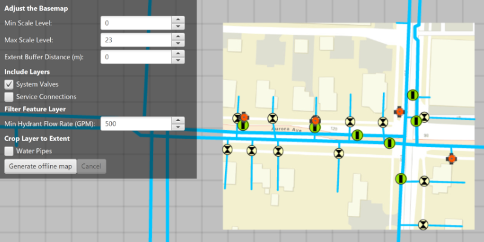

# Generate Offline Map (Overrides)

Take a web map offline with additional options for each layer.

For applications where you just need to take all layers offline, use the standard workflow (using only `GenerateOfflineMapParameters`). For a simple example of how you take a map offline, see the "Generate Offline Map" sample. For more fine-grained control over the data you are taking offline, use overrides to adjust the settings for each layer. Some example use cases for the overrides approach could be when you need to:

* adjust the extent for one or more layers to be different to the rest of the map.
* reduce the amount of data (such as tiles) downloaded for one or more layers in the map.
* filter features to be taken offline.
* take features with no geometry offline.

## How to use the sample

**Note: When manually inputting a value in the spinner controls, make sure to hit Enter to commit the value.**

Sign in with a free developer account when prompted for credentials (taking web maps offline requires an account).

Use the min/max scale spinners to adjust the level IDs to be taken offline for the Streets basemap.

Use the extent buffer distance spinner to set the buffer radius for the streets basemap.

Check the checkboxes for the feature operational layers you want to include in the offline map.

Use the min hydrant flow rate spinner to only download features with a flow rate higher than this value.

Select the "Water Pipes" checkbox if you want to crop the water pipe features to the extent of the map.

Click the "Generate offline map" button to start the download. A progress bar will display. Click the "Cancel" button if you want to stop the download. When the download is complete, the view will display the offline map. Pan around to see that it is cropped to the download area's extent.

# How it works

1. Load a web map from a `PortalItem`. Authenticate with the portal if required.
2. Create an `OfflineMapTask` with the map.
3. Generate default task parameters using the extent area you want to download with `offlineMapTask.createDefaultGenerateOfflineMapParametersAsync(extent)`.
4. Generate additional "override" parameters using the default parameters with `offlineMapTask.createGenerateOfflineMapParameterOverridesAsync(parameters)`.
5. For the basemap:
    * Get the parameters `OfflineMapParametersKey` for the basemap layer.
    * Get the `ExportTileCacheParameters` for the basemap layer with `overrides.getExportTileCacheParameters().get(basemapParamKey)`.
    * Set the level IDs you want to download with `exportTileCacheParameters.getLevelIDs().add(levelID)`.
    * To buffer the extent, use `exportTileCacheParameters.setAreaOfInterest(bufferedGeometry)` where bufferedGeometry can be calculated with the `GeometryEngine`.
6. To remove operational layers from the download:
    * Create a `OfflineParametersKey` with the operational layer.
    * Get the generate geodatabase layer options using the key with `List&lt;GenerateLayerOption&gt; layerOptions = overrides.getGenerateGeodatabaseParameters().get(key).getLayerOptions();`
    * Loop through each `GenerateLayerOption` in the the list, and remove it if the layer
.     option's ID matches the layer's ID.
7. To filter the features downloaded in an operational layer:
    * Get the layer options for the operational layer using the directions in step 6.
    * Loop through the layer options. If the option layerID matches the layer's ID. set the filter clause with
     `layerOption.setWhereClause(sqlQueryString)` and set the query option with `layerOption.setQueryOption(GenerateLayerOption.QueryOption.USE_FILTER)`.
8. To not crop a layer's features to the extent of the offline map (default is true):
    * Set `layerOption.setUseGeometry(false)`.
9. Create a `GenerateOfflineMapJob` with `offlineMapTask.generateOfflineMap(parameters, downloadPath, overrides)`. Start the job with `job.start()`.
10. When the job is done, get a reference to the offline map with `job.getResult.getOfflineMap()`.

## Relevant API

* ExportTileCacheParameters
* GenerateGeodatabaseParameters
* GenerateLayerOption
* GenerateOfflineMapJob
* GenerateOfflineMapParameterOverrides
* GenerateOfflineMapParameters
* GenerateOfflineMapResult
* OfflineMapParametersKey
* OfflineMapTask

## Tags

Offline
