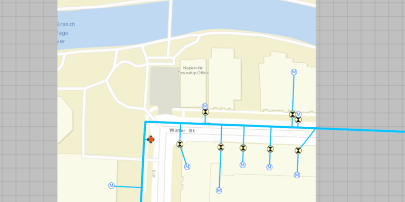

<h1>Generate Offline Map</h1>

Take an extent of a web map offline.

<h2>How to use the sample</h2>

When the app starts, you will be prompted to sign in using a free ArcGIS Online account. Once the map loads, zoom to the extent you want to take offline. The red border shows the extent that will be downloaded. Click the "Take Map Offline" button to start the offline map job. The progress bar will show the job's progress. When complete, the offline map will replace the online map in the map view.

<h2>How it works</h2>

To take a web map offline:

<ol>
    <li>Create an <code>ArcGISMap</code> with a portal item pointing to the web map.</li>
    <li>Create <code>GenerateOfflineMapParameters</code> specifying the download area geometry, min scale, and max scale.</li>
    <li>Create an <code>OfflineMapTask</code> with the map.</li>
    <li>Create the offline map job with <code>task.generateOfflineMap(params, downloadDirectoryPath)</code> and start it with <code>job.start()</code>.</li>
    <li>When the job is done, get the offline map with <code>job.getResult().getOfflineMap()</code>.</li>
</ol>

<h2>Relevant API</h2>

<ul>
  <li>GenerateOfflineMapJob</li>
  <li>GenerateOfflineMapParameters</li>
  <li>GenerateOfflineMapResult</li>
  <li>OfflineMapTask</li>
</ul>