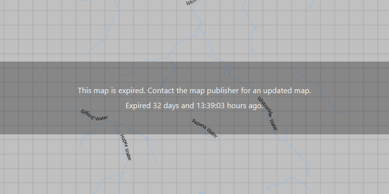

# Honor mobile map package expiration date

Determine a mobile map package's expiration date.

## Use case

The data contained within a mobile map package (MMPK) may only be relevant for a fixed period of time. Using ArcGIS Pro, the author of an MMPK can set an expiration date to ensure the user is aware the data is out of date.

As long as the author of an MMPK has set an expiration date, the expiration date can be read even if the MMPK has not yet expired. The expiration date can also be read to warn a user that the MMPK may be expiring soon.

## How to use the sample

Run the app to see the mobile map package's expiration date displayed.

## How it works

1. Create a `MobileMapPackage` using the URI to a local .mmpk file and load it.
2. Use `mobileMapPackage.getExpiration()` to get the expiration information. Get the expiration message with `getMessage()` and the expiration date with `getDate()`.

## Relevant API

* Expiration
* MobileMapPackage

## Tags

expiration, mmpk