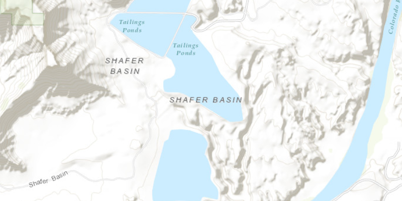

# Map Initial Extent

Display the map at an initial viewpoint.

## How to use the sample

As application is loading, initial view point is set and map view zooms to that location.

## How it works

To set an initial `Viewpoint`:

  1. Create an `ArcGISMap`.
  2. Create a view point using an `Envelope`, `Viewpoint(Envelope)`.
  3. Set the starting location of the ArcGIS map, `ArcGISMap.setInitialViewpoint(Viewpoint)`.
  4. Set the ArcGIS map to the `MapView`.

## Relevant API

  * ArcGISMap
  * Envelope
  * MapView
  * Point
  * Viewpoint

