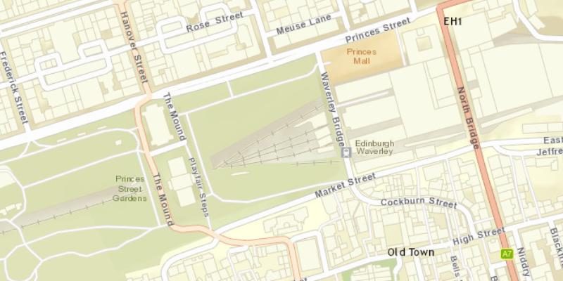

# Min Max Scale

Restrict zooming to a specific scale range.

## How to use the sample

The ArcGISMap has a minimum and maximum scale set which locks the map view in-between that range.

## How it works

To set the min and max scales on a `ArcGISMap`:

1.  Create an ArcGIS map.
2.  Set min and max scales of map, `ArcGISMap.setMaxScale()` and `ArcGISMap.setMinScale()`.
3.  Set the ArcGIS map to the `MapView`.

## Relevant API

*   ArcGISMap
*   Basemap
*   MapView
*   Viewpoint
