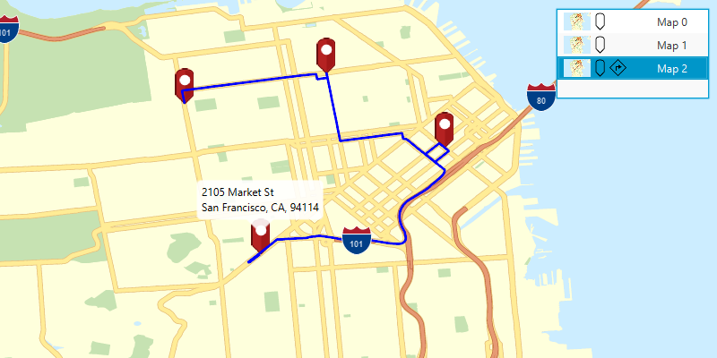

# Mobile map search and route

Use locators and networks saved in an offline map.

## How to use the sample

Click the "Open mobile map package" button to bring up a file choosing dialog. Browse to and select a .mmpk file. When chosen, the maps inside the mobile map package will be displayed in a list view. If the mobile map package has a locator task, the list items will have a pin icon. If the map contains transportation networks, it will have a navigation icon. Click on a map list item to open it. Click on the map to reverse geocode the clicked locations's address if a locator task is available. If transportation networks are available, a route will be calculated between geocode locations.

## How it works

To search and route from a mobile map package:

1. Create a `MobileMapPackage` passing in the path to the local mmpk file.
2. Load the mobile map package and get its maps with `mobileMapPackage.getMaps()`.
3. A `LocatorTask` can be retrieved from the mobile map package with `mobileMapPackage.getLocatorTask()` if it has one.
4. To see if a map has transportation networks saved with it call `map.getTransportationNetworks()`. Each `TransportationNetworkDataset` can be used to construct a `RouteTask`.

## Relevant API

* GeocodeResult
* MobileMapPackage
* ReverseGeocodeParameters
* Route
* RouteParameters
* RouteResult
* RouteTask
* TransportationNetworkDataset

## Tags

Offline, Routing, Search
