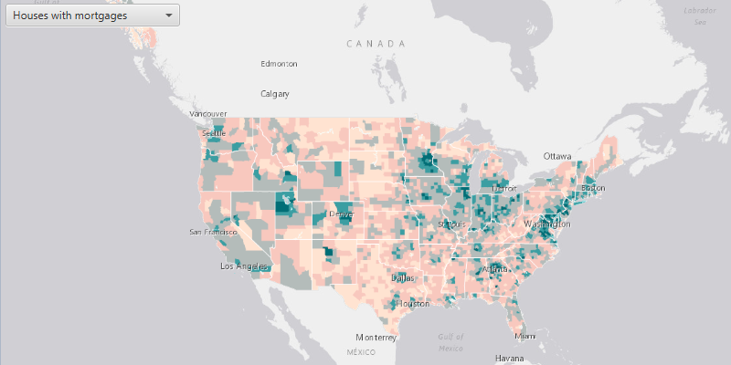

#Open an Existing Map#
Demonstrates how to open an existing web map.

##How to use the sample##
A ArcGISMap web map can be selected from the drop-down list. On selection the web map opens up in the MapView.

##How it works##
To open an existing web map:

1. Create a `Portal` from the ArcGIS url `http://www.arcgis.com/`.
2. Create a `PortalItem` using the Portal and the web map id, `WebMapEntry.getId()`.
3. Create a `ArcGISMap` using the portal item.
4. Set map to the `MapView`.

##Features
- ArcGISMap
- MapView
- Portal
- PortalItem
- WebMapEntry
