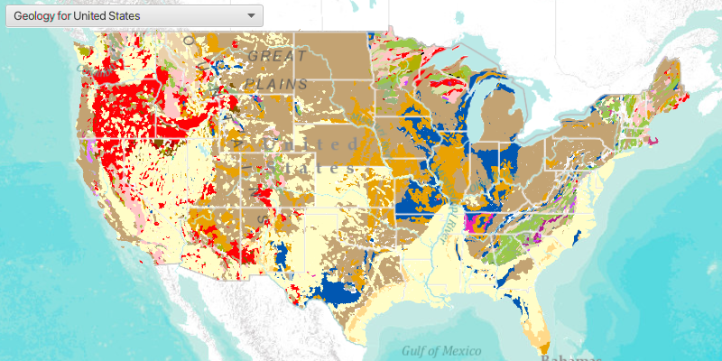

# Open Map (URL)

Display a web map.

## How to use the sample

A web map can be selected from the drop-down list. On selection the web map displays in the MapView.

## How it works

To open a web map:

1. Create a `Portal` from the ArcGIS URL http://www.arcgis.com.
2. Create a `PortalItem` using the Portal and the web map ID: `new PortalItem(portal, ID)`.
3. Create a `ArcGISMap` using the portal item.
4. Set the map to the `MapView`.

## Relevant API

* ArcGISMap
* MapView
* Portal
* PortalItem
