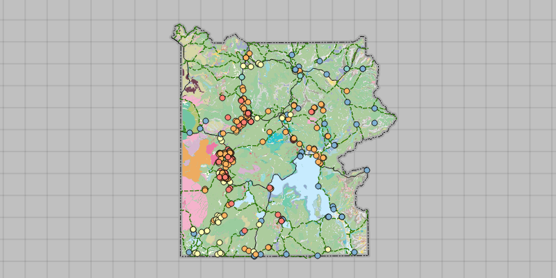

# Open Mobile Map Package

Display a map from a mobile map package.

## How it works

To display a map from a `MobileMapPackage`:

1. Create a `MobileMapPackage` specifying the path to the .mmpk file.
2. Load the mobile map package with `mmpk.loadAsync()`.
3. After it successfully loads, get the map from the mmpk and add it to the map view: `mapView.setMap(mmpk.getMaps().get(0))`.

## Relevant API

* MapView
* MobileMapPackage
