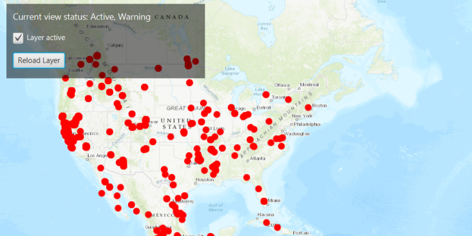

# Display layer view state

Determine if a layer is currently being viewed.

## Use case

The view status includes information on the loading state of layers and whether layers are visible at a given scale. You might change how a layer is displayed in a layer list to communicate whether it is being viewed in the map. For example, you could show a loading spinner next to its name when the view status is `LOADING`, grey out the name when `NOT_VISIBLE` or `OUT_OF_SCALE`, show the name normally when `ACTIVE`, or with a warning or error icon when the status is `WARNING` or `ERROR`.

## How to use the sample

Click the *Load Layer* button to create a new layer and add it to the map. As you pan and zoom around the map, note how the `LayerViewStatus` flags change; for example, `OUT_OF_SCALE` becomes true when the map is scaled outside of the layer's min and max scale range. Click the *Hide Layer* button to hide the layer and observe the view state change to `NOT_VISIBLE`.

If you disconnect your device from the network, you can pan around the map to see layers display the `WARNING` status when they cannot fetch online data. Reconnect to the network to see the warning disappear.

## How it works

1. Create an `ArcGISMap` with some operational layers.
2. Set the map on a `MapView`.
3. Add a `LayerViewStateChangedListener` to the map view to capture `LayerViewStateChangedEvent`.
4. Get the current view status with `event.getLayerViewStatus()`.

## Relevant API

* ArcGISMap
* LayerViewStatus
* LayerViewStateChangedEvent
* LayerViewStateChangedListener
* MapView

## About the data

The [Satellite (MODIS) Thermal Hotspots and Fire Activity](https://runtime.maps.arcgis.com/home/item.html?id=b8f4033069f141729ffb298b7418b653) layer presents detectable thermal activity from MODIS satellites for the last 48 hours. [MODIS Global Fires](https://earthdata.nasa.gov/earth-observation-data/near-real-time/firms/active-fire-data) is a product of NASA’s [Earth Observing System Data and Information System (EOSDIS)](https://earthdata.nasa.gov/about), part of NASA's [Earth Science Data](https://science.nasa.gov/earth-science/earth-data/). EOSDIS integrates remote sensing and GIS technologies to deliver global MODIS hotspot/fire locations to natural resource managers and other stakeholders around the World.

## Tags

layer, load, map, status, view, visibility
