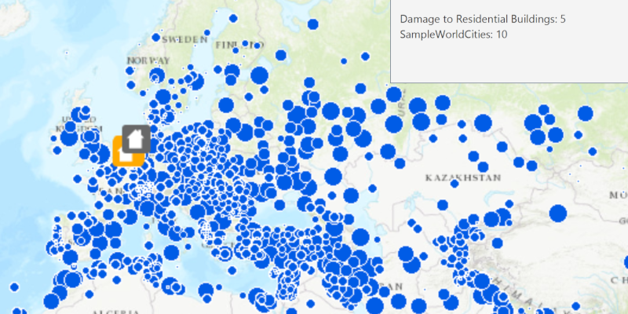

# Identify Layers

Get clicked features from multiple layers.

## How to use the sample

Tap on map to get features at that location. The number of features identified from each layer will be shown in an alert.

## How it works

To identify features from layers in a map:

1. Get a `Point2D` with the screen location where the user clicked.
2. Call `mapView.identifyLayersAsync(screenLocation, tolerance, returnPopupsOnly, maximumResults)`.
3. Get the list of `IdentifyLayerResult`s from the result. You can get the identified `GeoElement`s in the layer with `identifyLayerResult.getElements()`.
4. To find identified GeoElements in sublayers, use `identifyLayerResult.getSublayerResults()` and repeat the last step.

## Relevant API

*   ArcGISMapImageLayer
*   FeatureLayer
*   FeatureTable
*   IdentifyLayerResult
*   MapView

