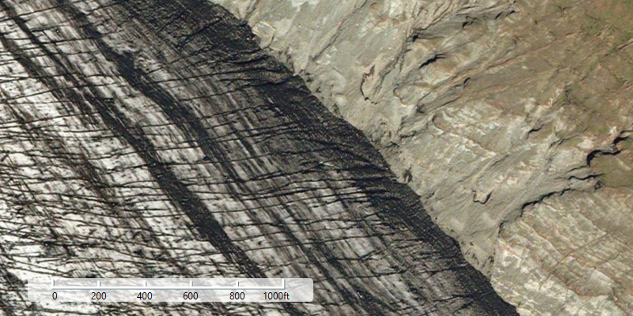

# Scale bar

Add a scale bar to visually gauge distances on a map.

## Use case

Allows a user to have a visual reference for distances when navigating the map.

## How to use the sample

Zoom in or out of the map. The scale bar will automatically display the appropriate scale based on zoom level. Units can be in metric and/or imperial.

## How it works

1. Create an `ArcGISMap` and display it in a `MapView`.
2. Create a `ScaleBar` passing in the map view.
3. Set the scale bar's skin style with `setSkinStyle(skinStyle)`.
4. Set the unit system with `setUnitSystem(unitSystem)`.
5. Add the scale bar to the UI overlaying the map view.
 
## Relevant API

* ArcGISMap
* MapView
* Scalebar
* UnitSystem

## Additional information

The scale will be accurate for the center of the map, and in general more accurate at larger scales (zoomed in). This means at smaller scales (zoomed out), the reading may be inaccurate at the extremes of the visible extent.

## Tags

map, measure, scale, toolkit
