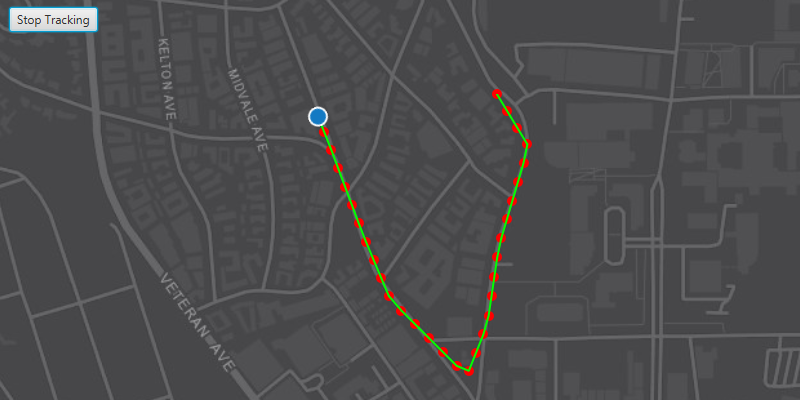

# Show location history

Display your location history on the map.

## Use case

You can track device location history and display it as lines and points on the map. The history can be used to visualize how the user moved through the world, to retrace their steps, or to create new feature geometry. For example, an unmapped trail could be added to the map using this technique.

## How to use the sample

Click the button to start tracking your location, which will appear as points on the map. A line will connect the points for easier visualization. Click the button again to stop updating the location history. This sample uses a simulated data source to allow the sample to be useful on desktop/non-mobile devices.

## How it works

1. Create a `GraphicsOverlay` to show each point and another `GraphicsOverlay` for displaying the route line.
2. Create a `SimulatedLocationDataSource` and initialize it with a polyline. Start the `SimulatedLocationDataSource` to begin receiving location updates.
3. Use a `LocationChangedListener` on the `simulatedLocationDataSource` to get location updates.
4. When the location updates store that location, display a point on the map at the location, and re-create the route polyline.

## Relevant API

* LocationDataSource
* LocationDataSource.Location
* LocationDataSource.LocationChangedEvent
* LocationDataSource.LocationChangedListener
* LocationDataSource.Position
* LocationDisplay.AutoPanMode
* MapView.LocationDisplay
* SimulatedLocationDataSource
* SimulationParameters

## About the data

A custom set of points is used to create a `Polyline` and initialize a `SimulatedLocationDataSource`. The simulated location data source enables easier testing and allows the sample to be used on devices without an actively updating GPS signal. To track a user's real position, use the `LocationDataSource` instead. 

## Tags

GPS, bread crumb, breadcrumb, history, movement, navigation, real-time, trace, track, trail