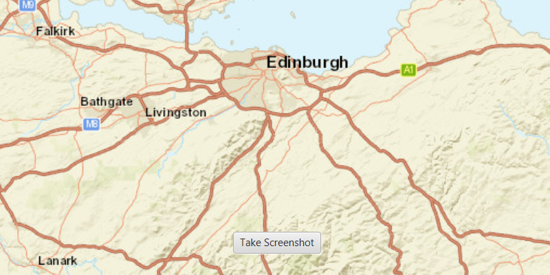

# Take screenshot

Take a screenshot of the map.

## How to use the sample

Click the "Take Screenshot" button to export the image. In the file chooser that opens, set a file name and location to save the image.

## How it works

1. Call `mapView.exportImageAsync()` and set it to a `ListenableFuture<Bitmap>`.
2. On done, call `get()` on the `ListenableFuture<Image>` and save it to the device.

## Relevant API

* ArcGISMap
* MapView

## Tags

capture, export, image, print, screen capture, screenshot, share, shot
