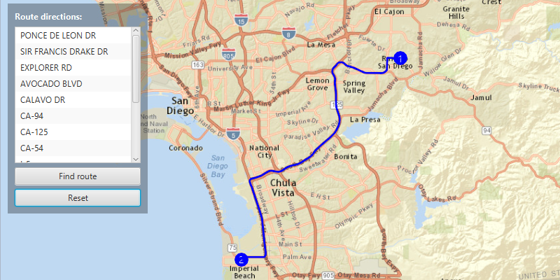

#Find Route#
Demonstrates how to get a route between two stops.

##How to use the sample##
For simplicity, the sample comes loaded with a start and end stop. You can click on the Find route button to get a route between these stops. Once the route is generated, the DirectionMessages show step by step directions in the directions list.

##How it works##
To display a `Route` using a `RouteTask`:

1. Create an `ArcGISMap`.
2. Add the map to the `MapView`, `MapView.setMap()`. 
3. Create a route task using an URL from an online service. 
  - online route task solves a route from an online route service
4. Set the `RouteParameters` to find a route between the `Stop`s. 
5. Get the route using the  `RouteTask.solveAsync(routeParameters)`.
6. Display the route by adding it to a `GraphicsOverlay.getGraphics().add()`.
7. Show the step by step `DirectionMessage`s using the `Route.getDirectionManeuvers()` method.

##Features##
- ArcGISMap
- DirectionManeuver
- DirectionMessage
- Graphic
- GraphicsOverlay
- MapView
- Route
- RouteTask
- RouteParameters
- RouteResult
- Stop
