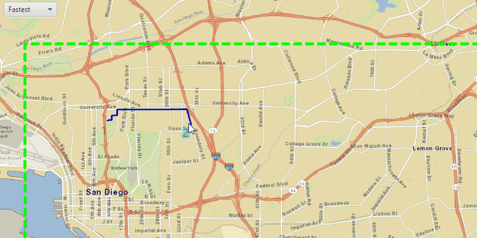

# Offline routing

Solve a route on-the-fly using offline data.

## Use case

You can use an offline network to enable routing in disconnected scenarios. For example, you could provide offline location capabilities to field workers repairing critical infrastructure in a disaster when network availability is limited.

## How to use the sample

Click near a road to start adding a stop to the route, click again to place it on the map. A number graphic will show its order in the route. After adding at least 2 stops, a route will display. Choose "Fastest" or "Shortest" from the drop down menu to control how the route is optimized. Use a secondary click on stops to select them, and then primary-click to re-place them. The route will update on-the-fly while moving stops. The green box marks the boundary of the routable area provided by the offline data.

## How it works

1. Create the map's `Basemap` from a local tile package using a `TileCache` and `ArcGISTiledLayer`.
2. Create a `RouteTask` with an offline locator geodatabase.
3. Get the `RouteParameters` using `routeTask.createDefaultParameters()`.
4. Create `Stop`s and add them to the route task's parameters.
5. Solve the `Route` using `routeTask.solveRouteAsync(routeParameters)`.
6. Create a graphic with the route's geometry and a `SimpleLineSymbol` and display it on another `GraphicsOverlay`.

## About the data

This sample uses a pre-packaged sample dataset consisting of a geodatabase with a San Diego road network and a tile package with a streets basemap.

## Relevant API

* RouteParameters
* RouteResult
* RouteTask
* Stop
* TravelMode

## Tags

connectivity, disconnected, fastest, locator, navigation, network analysis, offline, routing, routing, shortest, turn-by-turn
