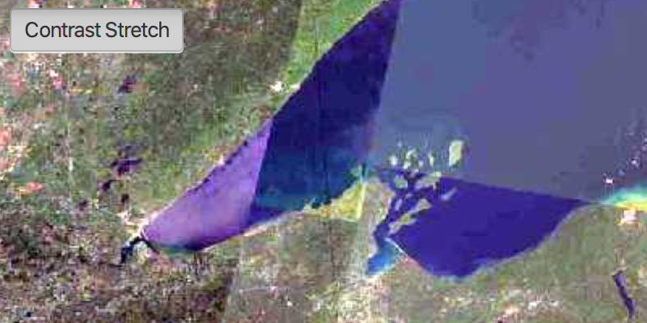

# Style WMS Layer

Change the style of a WMS layer.

## How to use the sample

Once the layer loads, the toggle button will be enabled. Click it to toggle between the first and second styles of the WMS layer.

## How it works

To style a WMS Layer:

1.  Create a `WmsLayer` specifying the URL of the service and the layer names you want `new WmsLayer(url, names)`.
2.  When the layer is done loading, get it's list of style strings using `wmsLayer.getSublayers().get(0).getSublayerInfo().getStyles()`.
3.  Set one of the styles using `wmsLayer.getSublayers().get(0).setCurrentStyle(styleString)`.

## Relevant API

*   WmsLayer
