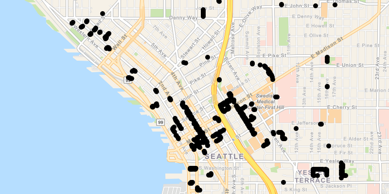

# Load WFS with XML query

Load a WFS feature table using an XML query.

## Use case

ArcGIS Runtime `QueryParameters` objects can't represent all possible queries that can be made against a WFS feature service. For example, Runtime query parameters don't support wildcard searches. However, queries can be provided as raw XML strings, allowing access to query functionality not available with `QueryParameters`.

## How it works

1. Create a `WfsFeatureTable` with a URL.

2. Set the feature table's axis order to `NO_SWAP`, and the feature request mode to `MANUAL_CACHE`.

3. Create a `FeatureLayer` from the feature table and add it to the map's operational layers.

4. Call `populateFromServiceAsync` on the feature table to populate it with only those features returned by the XML query.

## Relevant API

* FeatureLayer

* WfsFeatureTable

## About the data

This service shows trees in downtown Seattle and the surrounding area. An XML-encoded `GetFeature` request is used to limit results to only trees of the genus * Tilia *.

For additional information, see the underlying service on <a href="https://arcgisruntime.maps.arcgis.com/home/item.html?id=1b81d35c5b0942678140efc29bc25391">ArcGIS Online</a>.

## Tags

OGC, WFS, feature, web, service, XML, query
