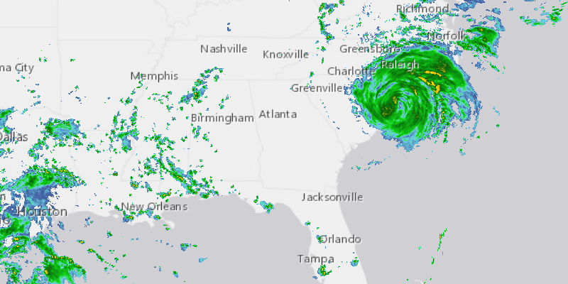

# WMS Layer URL

Display a WMS layer.

## How it works

To create a `WmsLayer` from a URL and display it:

  1. Create a `WmsLayer` specifying the URL of the service and the layer names you want `new 
  WmsLayer(url, names)`.
  2. To display it, add it to the map as an operational layer `map.getOperationalLayers().add(wmsLayer)`.

## Relevant API

  * ArcGISMap
  * MapView
  * WmsLayer

