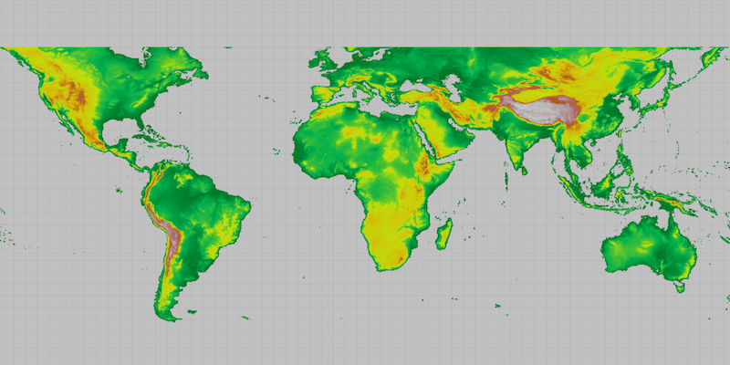

# WMTS Layer

Dsiplay tiles from a Web Map Tile Service.

## How it works

To display a `WmtsLayer` from a `WmtsService`:

  1. Create a `WmtsService` using the URL of the WMTS Service.
  2. After loading the WmtsService, get the list of `WmtsLayerInfo`s from the service info: 
  `service.getServiceInfo().getLayerInfos()`
  3. For the layer you want to display, get the layer ID using `getLayerInfos().get(0).getId()`
  4. Use the LayerInfo to create the WMTSLayer: `new WmtsLayer(layerInfos.get(0))`
  5. Set it as the maps' basemap with `map.setBasemap(new Basemap(wmtsLayer))`

## Relevant API

  * ArcGISMap
  * Basemap
  * MapView
  * WmtsLayer
  * WmtsService

