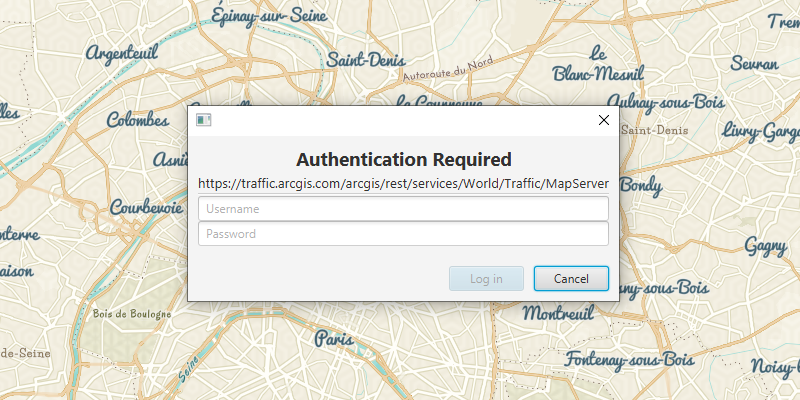

# Token authentication

Access a map service that is secured with an ArcGIS token-based authentication.

## Use case

Applications often require accessing data from private map services on remote servers. A token authentication system can be used to allow app users who hold a valid username and password to access the remote service.

## How to use the sample

When starting the sample, the user is challenged for an ArcGIS Online login to view the protected map service. Enter a username and password for an ArcGIS Online named user account (such as your ArcGIS for Developers account). Upon successful authentication, the protected map service will display in the map.

## How it works

1.  Create an `AuthenticationChallengeHandler` using the `DefaultAuthenticationChallengeHandler` to handle the challenges sent by the protected map service.
2.  Set the `AuthenticationChallengeHandler` used by the `AuthenticationManager`.
3.  Create a `Portal` to ArcGIS Online.
4.  Create a `PortalItem` for the protected web map using the `Portal` and Item ID of the protected map service as parameters
5.  Create an `ArcGISMap` from the portal item, and display it in a `MapView`
6.  Set the map to display in the map view.

## Relevant API

*   AuthenticationChallengeHandler
*   AuthenticationManager
*   DefaultAuthenticationChallengeHandler
*   Map
*   MapView
*   Portal
*   PortalItem

## Tags

authentication, map service, security, token