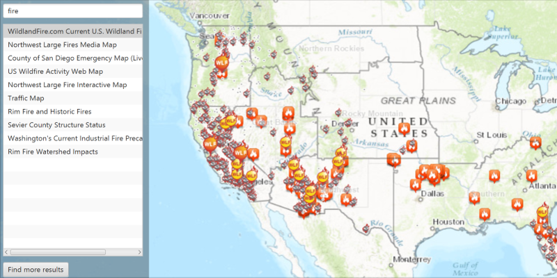

# Webmap Keyword Search

Find webmaps within a portal using a keyword.

## How to use the sample

Input a keyword into the text field and press Enter to search. Click on a result to show the webmap in the map view. 
Click on the "Find More Results" button to add more results to the list.

## How it works

To search for webmaps in a `Portal` matching a keyword:

1.  Create a `Portal` and load it
2.  Create `PortalItemQueryParameters`. Set the type to `PortalItem.Type.WEBMAP` and the 
  query to the keyword you want to search
3.  Use `portal.findItemsAsync(params)` to get the first set of matching items.
4.  Get more results with `portal.findItemsAsync(portalQueryResultSet.getNextQueryParameters())`

## Relevant API

*   ArcGISMap
*   MapView
*   Portal
*   PortalItem
*   PortalQueryParameters
*   PortalQueryResultSet

