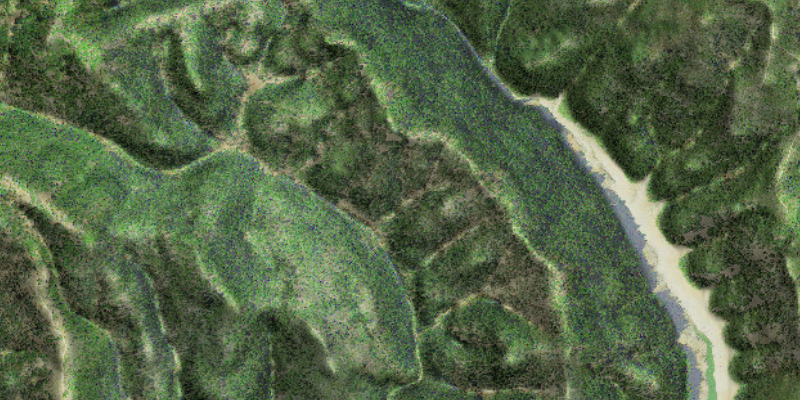

<h1>Blend Renderer</h1>

Apply a blend renderer to a raster.

Blend renderers can be used to blend elevation data with imagery, creating a 3D effect.

<h2>How to use the sample</h2>

Choose and adjust the settings to update the blend renderer on the raster layer. To use a color ramp instead of 
the satellite imagery, choose the color ramp type NONE.

<h2>How it works</h2>

To apply a <code>BlendRenderer</code> to a <code>RasterLayer</code>:

<ol>
  <li>Create a <code>Raster</code> from a raster file</li>
  <li>Create a <code>RasterLayer</code> from the raster</li>
  <li>Create a <code>Basemap</code> from the raster layer and set it to the map</li>
  <li>Create a <code>Raster</code> for elevation from a grayscale raster file</li>
  <li>Create a <code>BlendRenderer</code>, specifying the elevation raster, color ramp, and other properties
  <ul>
    <li>If you specify a non-null color ramp, use the elevation raster as the base raster in addition to the 
    elevation raster parameter. That way the color ramp is used instead of the satellite imagery</li>
  </ul>
  </li>
  <li>Set the renderer on the raster layer with <code>rasterLayer.setRenderer(renderer)</code>.</li>
</ol>

<h2>Relevant API</h2>

<ul>
  <li>ArcGISMap</li>
  <li>Basemap</li>
  <li>BlendRenderer</li>
  <li>ColorRamp</li>
  <li>MapView</li>
  <li>Raster</li>
  <li>RasterLayer</li>
</ul>
