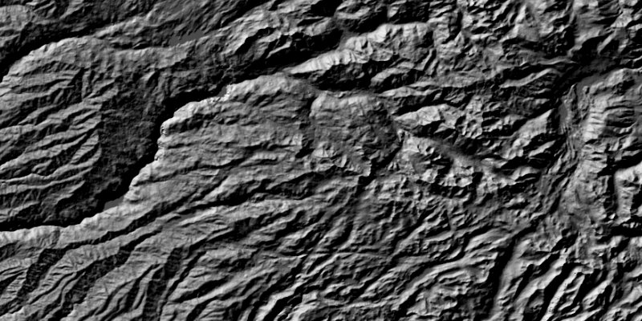

# Hillshade Renderer

Apply a hillshade renderer to a raster.

Hillshade renderers can adjust a grayscale raster (usually of terrain) according to a sun angle.

## How to use the sample

Choose and adjust the settings to update the hillshade renderer on the raster layer.

## How it works

To apply a `HillshadeRenderer` to a `RasterLayer`:

1.  Create a `Raster` from a grayscale raster file
2.  Create a `RasterLayer` from the raster
3.  Create a `Basemap` from the raster layer and set it to the map
4.  Create a `HillshadeRenderer`, specifying the slope type and other properties
5.  Set the renderer on the raster layer with `rasterLayer.setRenderer(renderer)`.

## Relevant API

*   ArcGISMap
*   Basemap
*   HillshadeRenderer
*   MapView
*   Raster
*   RasterLayer

