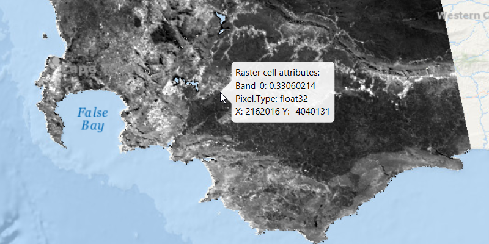

# Identify raster cell

Get the cell value of a local raster and display the result in a callout.

## Use case

You may want to identify a raster layer to get its exact cell value in the case the approximate value conveyed by its symbology is not sufficient. The information available for the raster cell depends on the type of raster layer being identified. For example, a 3-band satellite or aerial image might provide 8-bit RGB values, whereas a digital elevation model (DEM) would provide floating point z values. By identifying a raster cell of a DEM, you can retrieve the precise elevation of a location.

## How to use the sample

Move the mouse pointer over an area of the raster to identify the raster cell at that location. The raster cell attribute information will display in a callout. You can click the primary mouse button to lock the callout in place, and click again to release the callout and resume identifying on-the-fly.

## How it works

1. Add a listener to the `MapView` to capture mouse clicks.
2. On click:
  * Dismiss the `Callout`, if one is showing.
  * Call `identifyLayerAsync(...)` passing in the raster layer, screen point, tolerance, whether to return popups only, and maximum number of results.
  * Await the result of the identify and then get the `GeoElement` from the layer result.
  * Create a callout at the calculated map point and populate the callout content with text from the `RasterCell` attributes. 
  * Show the callout.

## Relevant API

* IdentifyLayerResult
* RasterCell
* RasterLayer

## About the data

The data shown is an NDVI classification derived from MODIS imagery between 27 Apr 2020 and 4 May 2020. It comes from the [NASA Worldview application](https://worldview.earthdata.nasa.gov/). In a normalized difference vegetation index, or [NDVI](https://en.wikipedia.org/wiki/Normalized_difference_vegetation_index), values range between -1 and +1 with the positive end of the spectrum showing green vegetation.

## Tags

band, cell, cell value, continuous, discrete, identify, pixel, pixel value, raster
