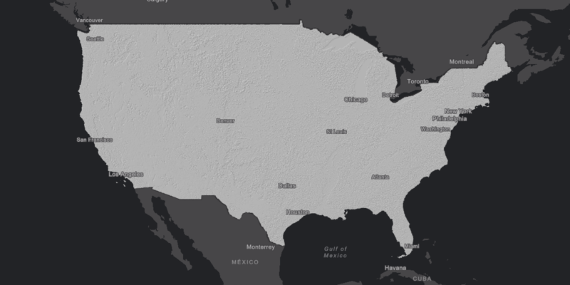

# Raster Function

Apply a raster function to a raster.

Raster functions are operations performed on a raster to apply on-the-fly processing. In this sample, a hillshade raster function is applied to an online raster image service.

## How it works

To create a `RasterLayer` using a `RasterFunction` and add it to the map:

1.  Create an initial raster such as an `ImageServiceRaster`
2.  Create a `RasterFunction` from a json string source
3.  Get the raster function's arguments with `rasterFunction.getArguments()`
4.  Set the initial raster and raster name in the arguments: `arguments.setRaster(arguments.getRasterNames().get(0), imageServiceRaster)`
5.  Create a new `Raster` from the function
6.  Create a `RasterLayer` with the new raster
7.  Add it as an operational layer with `map.getOperationalLayers().add(rasterLayer)`

## Relevant API

*   ArcGISMap
*   Basemap
*   ImageServiceRaster
*   MapView
*   RasterFunction
*   RasterFunctionArguments
*   RasterLayer
