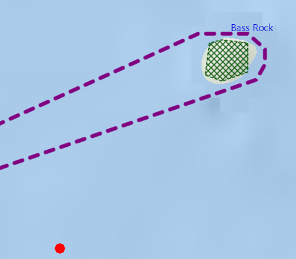

#Add Graphics with Symbols#
This sample demonstrates how to add points, polylines, and polygons as graphics, set a symbol renderer to the graphics and add to a `GraphicsOverlay`. The sample also adds `TextSymbol` to represent text as symbols on the GraphicsOverlay.

##How it works##
To add `Graphic`s with symbols.

- Create a GraphicsOverlay and add it to the `MapView`.
- Add `Point`s are created by adding each of them to a `Graphic` along with a
`SimpleMarkerSymbol`. 
- Add the graphic is then added to the `GraphicsOverlay`. 
- `Polyline`s, `Polygon`s, and text are created in the same fashion by using a `SimpleLineSymbol`,  `SimpleFillSymbol`, `TextSymbol` respectively.

##Features##
- MapView
- Graphic
- GraphicsOverlay
- Point
- PointCollection
- Polygon
- Polyline