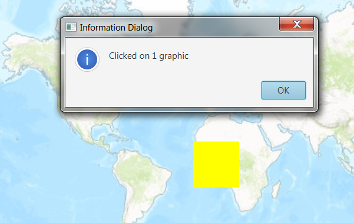

#Identify Graphics#
This sample demonstrates how to create a `Graphic` and add it to a `GraphicOverlay` where it can be identified from the `MapView`.

##How to use the sample##
When you click on a graphic on the map, you should see an alert.

##How it works##
To identify `Graphic`s from the MapView.

- Create a GraphicsOverlay and add it to the `MapView`.
- Add `Graphic` along with a `SimpleFillSymbol`. 
- Add the graphic to the `GraphicsOverlay`. 
- Identify the graphics on the specified location using the `mapView#identifyGraphicsOverlayAsync(graphicsOverlay, point, tolerance, max results)` method.

##Features##
- MapView
- Graphic
- GraphicsOverlay
- PointCollection
- Polygon
- SimpleFillSymbol
