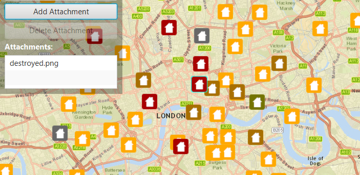

#Edit Feature Attachments#
This sample demonstrates how you can add, delete, and fetch `Attachment`s for a `ArcGISFeature` in a `FeatureLayer`. 

##How to use the sample##
Click on a `Feature`, the panel in the left specifies the list of attachments for that particular feature. In the list you can, add/delete an attachment by clicking on the Add/Delete buttons. 

##How it works##
To get features from a `ServiceFeatureTable` get its features and add/delete the attachments:

- Create a ServiceFeatureTable from a URL.
- Create a FeatureLayer from the ServiceFeatureTable.
- Select features from the FeatureLayer via `FeatureLayer#selectFeatures` method.
- To fetch the feature's attachments, cast to an ArcGISFeature and use the `ArcGISFeature#fetchAttachmentsAsync` method.
- To add an attachment to the selected ArcGISFeature, create an `Attachment` and use the `ArcGISFeature#addAttachmentAsync` method.
- To delete an attachment from the selected ArcGISFeature, use the `ArcGISFeature#deleteAttachmentAsync` method.
- After a change, apply the changes on the server using `ServiceFeatureTable#applyEditsAsync` method.

##Features##
- ArcGISMap
- MapView
- Feature
- FeatureLayer
- ServiceFeatureTable
- Attachment