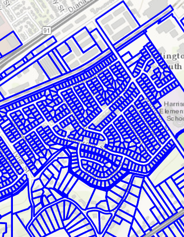

#Change Feature Layer Renderer#
This sample demonstrates how to change the `Renderer` for a `FeatureLayer`.

##How to use the sample##
Use the buttons in the control panel to change the renderer.

##How it works##
To change the Renderer in your FeatureLayer

- Create a ServiceFeatureTable from a URL.
- Create a FeatureLayer from the ServiceFeatureTable.
- Create a new Renderer (in this case, a `SimpleRenderer`).
- Change the FeatureLayer Renderer using `featureLayer.setRenderer(SimpleRenderer)`.

##Features##
- ArcGISMap
- MapView
- FeatureLayer
- ServiceFeatureTable
- SimpleRenderer
