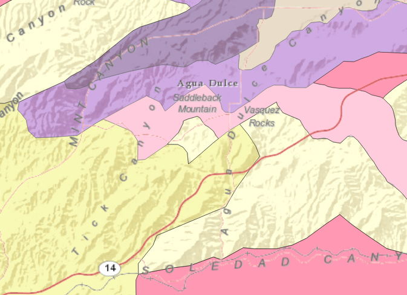

#Feature Layer Feature Service#
This sample shows how to create a `FeatureLayer` from a `ServiceFeatureTable` and add it to an `ArcGISMap`.

##How it works##
To add the Features in your FeatureLayer to a map

- Create a ServiceFeatureTable from a URL.
- Create a FeatureLayer from the ServiceFeatureTable.
- Set the FeatureLayer to your ArcGISMap using `map.getOperationalLayers().add(featureLayer)`.

##Features##
- ArcGISMap
- MapView
- FeatureLayer
- ServiceFeatureTable
