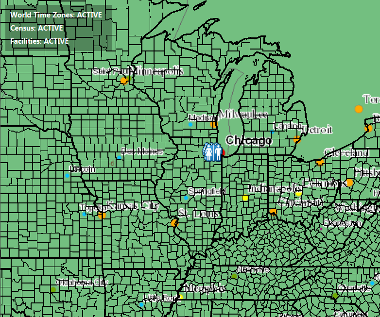

#Display Layer View State Status#
This sample demonstrates how to get view status for layers in a `ArcGISMap`. The sample displays the list of operational layers in the map. Each row in this list also has the view status corresponding to that layer. If you pan or zoom the map, the view status of some layers may change. The `LayerViewStatus` could be
- ACTIVE
- ERROR
- LOADING
- NOT_VISIBLE
- OUT_OF_SCALE
- UNKNOWN

##How to use the sample##
The MapView has a property called `addLayerViewStateChangedListener` that get executed every time a layer's view status changes. The property contains two attributes, the `Layer` whose state got changed and the  `LayerViewStatus` defining the new state.

##How it works##
To use the MapView's DrawStatus:

- Create an ArcGISMap 
- Set the map to the view via `MapView` via `MapView#setMap()`. 
- Add the `MapView#addLayerViewStateChangedListener` property and listen when the `LayerViewStatus` changes via `LayerViewStateChangedEvent`.

##Features##
- ArcGISMap
- MapView
- LayerViewStatus 
- LayerViewStateChangedEvent