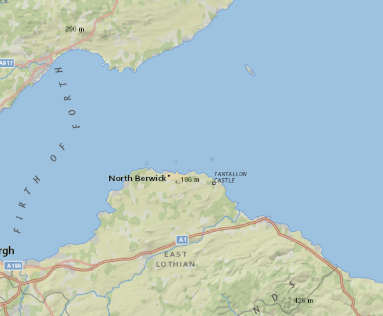

#Set Initial Map Location#
This sample creates an `ArcGISMap` with a standard ESRI National Geographic `Basemap` that is centred on a latitude and longitude location and zoomed into a specific level of detail.

##How to use the sample##
The sample uses the all-encompassing ArcGISMap constructor to initialize with the national geographic basemap at an initial location and level of detail. The basemap is one of the standard ArcGIS Online basemaps and is defined using BasemapType of .NATIONAL_GEOGRAPHIC.

##How it works##
To set an initial location:

- Create an ArcGISMap using a default basemap type such us `Basemap#Type#NATIONAL_GEOGRAPHIC`, indicate the longitude and latitude coordinates and the level of details.  
- Set the map to the view via `MapView` via `MapView#setMap()`. 

##Features##
- ArcGISMap
- Basemap
- MapView
