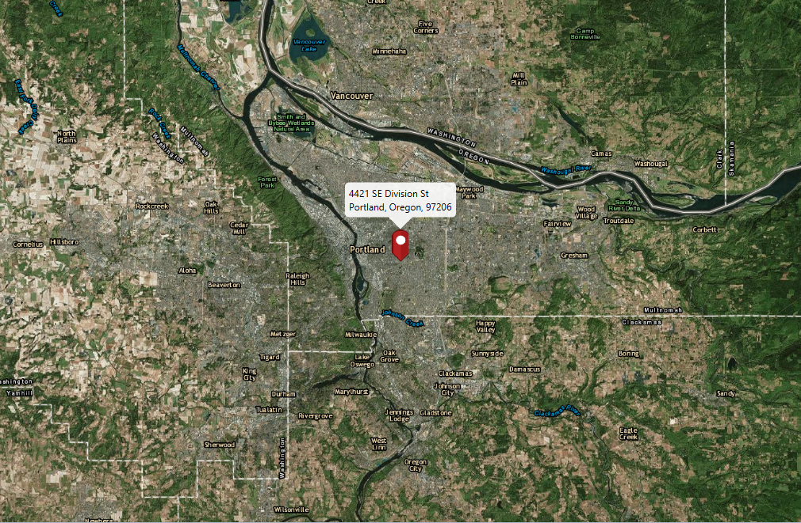

#Reverse Geocode Online#
This sample demonstrates how to reverse geocode a location and find its nearest address.

##How to use the sample##
You can click on the `ArcGISMap` to perform online reverse geocoding and show the matching results in the `ArcGISMap`. 

##How it works##
To perform online reverse geocode:

- Create the `ArcGISMap`'s basemap, in this case we used an offline `TileCache`. 
- Create a `LocatorTask` using a URL.
- Set the `GeocodeParameters` for the LocatorTask and specify the geocodes' attributes.
- Get the matching results from the `GeocodeResult` using the `LocatorTask#reverseGeocodeAsync` method.
- Lastly, to show the results using a `PictureMarkerSymbol` with attributes and add the symbol to a `GraphicsOverlay`.

##Features##
- ArcGISMap
- MapView
- GraphicsOverlay
- GeocodeParameters
- ReverseGeocodeParameters
- LocatorTask 
- GeocodeResult