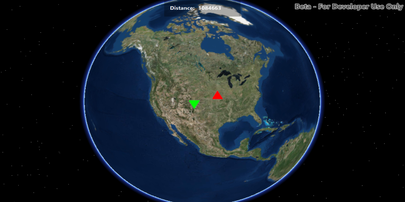

#Calculate Distance 3D
D.

##How to use the sample
A

##How it works
To :

1. Create a `GraphicsOverlay` and attach it to the `SceneView`.

##Features
- ArcGISScene
- Graphic
- GraphicsOverlay
- SceneView
