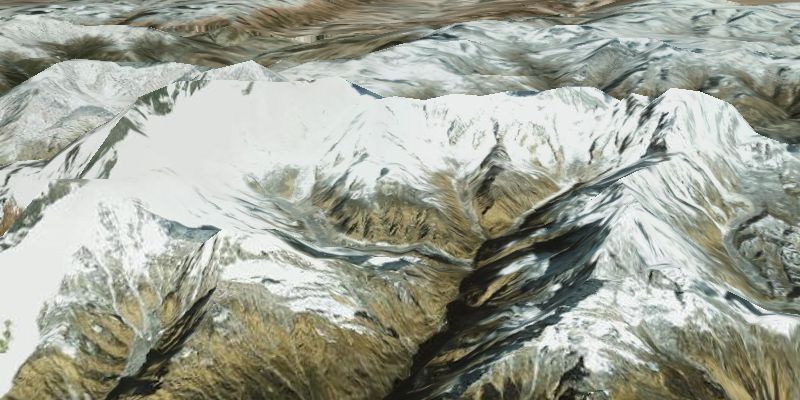

#Display Scene#
Demonstrates how to display a scene with an elevation source. An elevation source allows objects to be viewed in 3D, like this picture of Mt. Everest.

##How it works##
To create an `ArcGISScene` with elevation data:

1. Create an ArcGIS scene and set the `Basemap` with `ArcGISScene.setBasemap()`.
2. Create a `SceneView` and set the scene to the view, `SceneView.setScene(scene)`.
3. Create a `Surface` and add a `ArcGISTiledElevationSource`, `Surface.getElevationSources().add()`.
4. Set the surface as the scene's base surface: `ArcGIScene.setBaseSurface(surface)`.

##Tags
- ArcGISScene
- ArcGISTiledElevationSource
- Camera
- SceneView
- Surface
