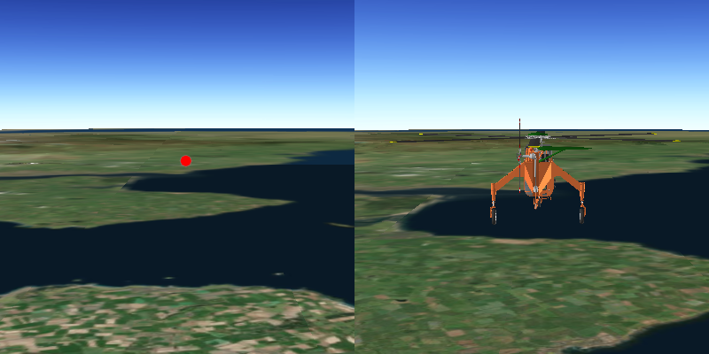

#Distance Composite Symbol#
Demonstrates how to create a graphic using a distance composite scene symbol. Distance composite scene symbols can 
render different symbols depending on the distance between the camera and the graphic.

##How to use the sample##
The symbol of graphic will change while zooming in or out.

##How it works##
To create and display a `DistanceCompositeSceneSymbol`:

1. Create a `GraphicsOverlay` and add it to the `SceneView`.
2. Create symbols for each `Range` the composite symbol.
3. Create a distance composite scene symbol`.
4. Add a range for each symbol to `DistanceCompositeSceneSymbol.getRangeCollection().add(new Range(symbol, min distance, max distance))`.
  - symbol, symbol to be used within the min/max range that is given
  - min/max distance, the minimum and maximum distance that the symbol will be display from the `Camera`
5. Create a `Graphic` with the symbol: `Graphic(Point, DistanceCompositeSceneSymbol)`
6. Add the graphic to the graphics overlay.

##Tags
- ArcGISScene
- ArcGISTiledElevationSource
- Camera
- DistanceCompositeSceneSymbol
- DistanceCompositeSceneSymbol.Range
- Graphic
- GraphicsOverlay
- ModelSceneSymbol
- Range
- RangeCollection
- SceneView
- SimpleMarkerSceneSymbol
