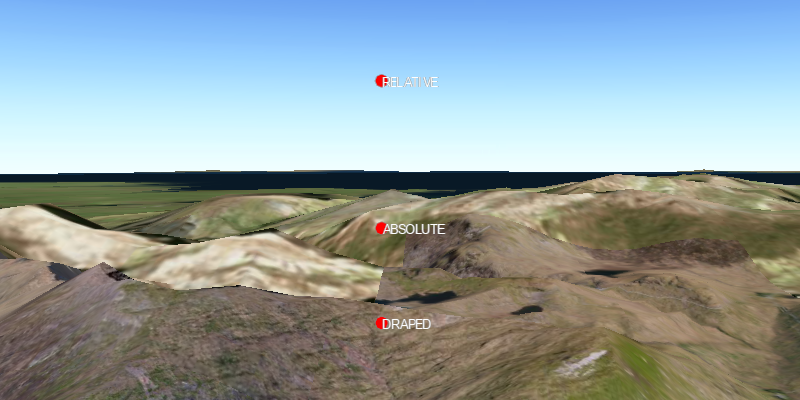

#Elevation Mode#
Demonstrates how to position graphics using different elevation modes.

##How it works##
To position graphics using an elevation mode (DRAPED, RELATIVE, ABSOLUTE):

1. Create a `GraphicsOverlay`.
2. Set the surface placement: `graphicsOverlay.getSceneProperties().setSurfacePlacement(SurfacePlacement.DRAPED);`.
3. Add graphics to the graphics overlay: `graphicsOverlay.getGraphics.add(graphic)`.
4. Add the graphics overlay to the `SceneView`: `sceneView.getGraphicsOverlays().add(graphicsOverlay)`.

##Features##
- ArcGISScene
- Graphic
- GraphicsOverlay
- SceneProperties
- SceneView
- LayerSceneProperties.SurfacePlacement